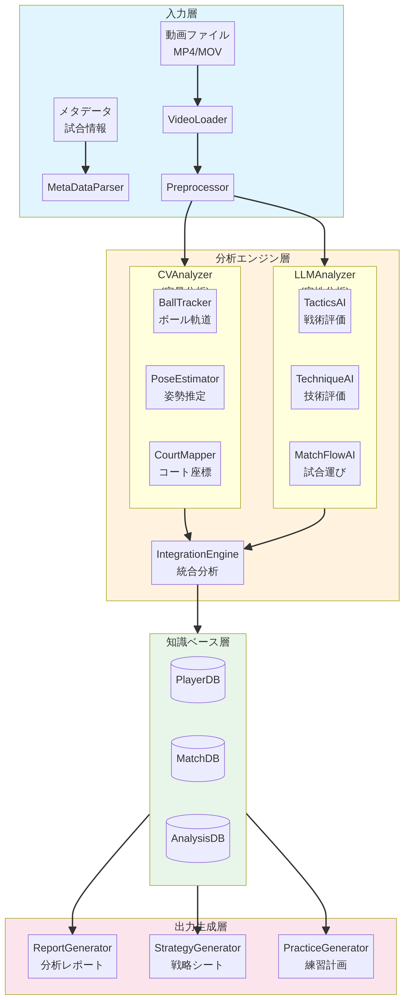

# システム概要設計書 v2.0：AI主導型 卓球パフォーマンス最大化システム

**ドキュメントID**: DES-01  
**バージョン**: 2.0  
**作成日**: 2026年1月4日  
**作成者**: Manus AI (PM)  
**ステータス**: レビュー完了

---

## 1. 設計概要

### 1.1. 本ドキュメントの目的

本ドキュメントは、「業務要件書 v2.0 (REQ-01)」に基づき、システム全体のアーキテクチャ、モジュール構成、データフロー、技術選定を定義する概要設計書である。

### 1.2. システム全体像

本システムは、卓球の試合・練習動画を入力とし、AIによる多角的な分析を経て、「深い分析レポート」「試合戦略シート」「練習計画書」を自動生成するエンドツーエンドのパイプラインである。

---

## 2. 業務要件トレーサビリティ

本設計が業務要件書(REQ-01)のどの要件に対応するかを明確にする。

| 要件ID | 要件名 | 対応モジュール/機能 | 設計状況 |
|:---|:---|:---|:---:|
| **FA-01** | 得点/失点パターン分析 | CVAnalyzer, IntegrationEngine | ✅ |
| **FA-02** | 技術別パフォーマンス分析 | CVAnalyzer, IntegrationEngine | ✅ |
| **FA-03** | サーブ/レシーブ分析 | CVAnalyzer, IntegrationEngine | ✅ |
| **FA-04** | フォーム分析 | PoseEstimator, TechniqueAI | ✅ |
| **FA-05** | フットワーク分析 | PoseEstimator, CourtMapper | ✅ |
| **FA-06** | 相手の得点/失点パターン分析 | CVAnalyzer, IntegrationEngine | ✅ |
| **FA-07** | 相手のサーブ/レシーブ傾向分析 | CVAnalyzer, IntegrationEngine | ✅ |
| **FA-08** | 相手の弱点特定 | IntegrationEngine | ✅ |
| **FS-01** | 対戦相手別戦略シート生成 | StrategyGenerator | ✅ |
| **FS-02** | サーブ戦略提案 | StrategyGenerator | ✅ |
| **FS-03** | レシーブ戦略提案 | StrategyGenerator | ✅ |
| **FS-04** | ラリー展開戦略提案 | StrategyGenerator | ✅ |
| **FP-01** | 課題の優先順位付け | PracticeGenerator | ✅ |
| **FP-02** | カスタム練習メニュー生成 | PracticeGenerator | ✅ |
| **FP-03** | フォーム改善ドリル提案 | TechniqueAI, PracticeGenerator | ✅ |
| **FR-01** | 試合後サマリーレポート | ReportGenerator, MatchFlowAI | ✅ |
| **FR-02** | パフォーマンスダッシュボード | （Phase 3で対応） | ❌ |
| **FR-03** | プレー動画へのアノテーション | （Phase 3で対応） | ❌ |
| **NF-01** | パフォーマンス | 全体設計で考慮 | ✅ |
| **NF-02** | ユーザビリティ | 出力生成層で考慮 | ✅ |
| **NF-03** | データ入力 | VideoLoader | ✅ |
| **NF-04** | 技術スタック | 全体設計で定義 | ✅ |
| **NF-05** | セキュリティ | （Phase 3で対応） | ❌ |

---

## 3. システムアーキテクチャ

### 3.1. レイヤー構成

本システムは以下の4層で構成される。

| レイヤー | 役割 | 主要コンポーネント |
|:---|:---|:---|
| **入力層** | 動画・メタデータの受け取りと前処理 | VideoLoader, Preprocessor |
| **分析エンジン層** | 定量分析・定性分析の実行 | CVAnalyzer, LLMAnalyzer, IntegrationEngine |
| **知識ベース層** | 分析結果・選手データの蓄積 | PlayerDB, MatchDB, AnalysisDB |
| **出力生成層** | レポート・戦略シートの自動生成 | ReportGenerator, StrategyGenerator, PracticeGenerator |

### 3.2. モジュール構成図

（変更なし、v1.0の図を流用）

---

## 4. モジュール詳細設計

（v1.0から変更なし、ただし各モジュールの「対応要件」を上記トレーサビリティ表に集約）

---

## 5. データベース設計

（v1.0から変更なし）

---

## 6. データフロー

（v1.0から変更なし）

---

## 7. 技術スタック

（v1.0から変更なし）
